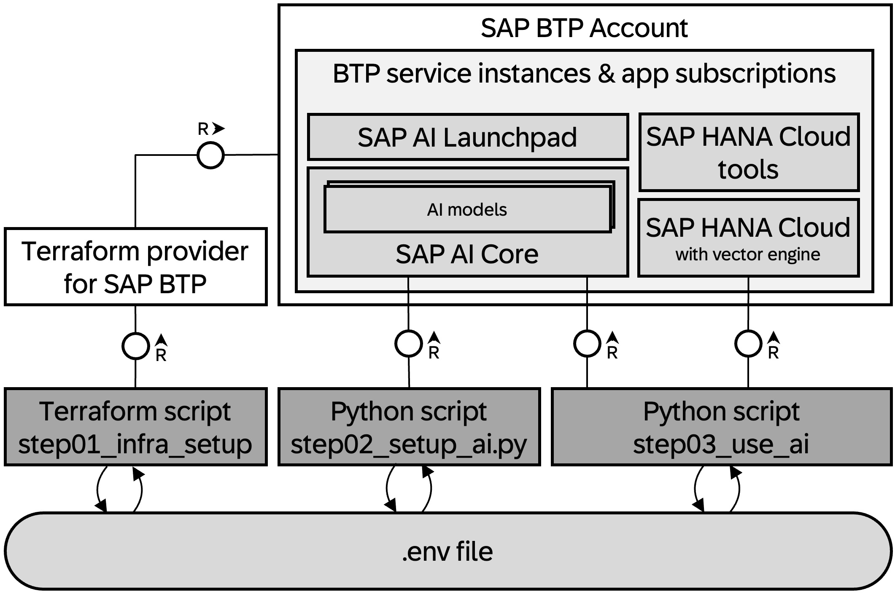
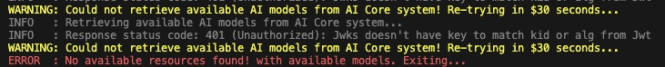

# The genAI Starter Kit ("as easy as 1, 2, 3")

This repo wants to give **SAP internal developers** a kick-start to get into the genAI topic more easily and more quickly:

- Infrastructure provisioning and AI Core configuration is automated with the [Terraform provider for SAP BTP](https://github.com/SAP/terraform-provider-btp) and the AI Core API, so you only need to add entitlements to your BTP Global Account as mentioned in the [Pre-requisites](#pre-requisites) section.
- Then we demonstrate an example *Retrieval Augmented Generation (RAG)* application that uses various SAP technologies and a recommended way building LLM-based applications on BTP using: 
  - SAP HANA Cloud Vector Engine
  - Langchain Python SDK 0.1.x with the SAP HANA Cloud Vector Engine support
  - SAP GenAI Hub
  - SDK for generative AI hub on SAP AI Core

Follow the steps below to get prepared for your experiments and projects. 

## Pre-requisites

- You have access to a BTP global account or an existing BTP sub account.
- The BTP global account (currently) needs to be in the SAP internal `EU10 Canary` landscape.
- `Visual Studio Code` is installed on your machine with the `Dev Container` extension. You understand purpose and basic concepts of [Dev Containers in VS Code](https://code.visualstudio.com/docs/devcontainers/containers).
- As prerequisite for using dev containers, `Docker` is installed on your machine and you understand its basics concepts.
- `Git` is available on your machine (test with `git --version`) and you know how to clone a project from github.
- The BTP global account needs to be sufficiently entitled to use the following services and applications:

  | Name | Service/ Application | Plan |
  | --- | --- | --- | 
  | **AI Core** | `aicore` (service)| `sap-internal` |
  | **AI Launchpad** | `ai-launchpad` (app subscription) | `standard` |
  | **HANA Cloud** | `hana-cloud` (service) | `hana` |
  | **HANA Cloud Tools** | `hana-cloud-tools` (app subscription) | `tools` |

> 📝 You can manage your global account in the [BTP Control Center](https://cp-control-client-uc2.cfapps.eu10.hana.ondemand.com/index.html) and entitle your BTP global account to use the services/ applications listed above with the mentioned service plans.

## Step 1: Setup SAP BTP infrastructure

- Clone this GitHub repository to your local machine and open it in VS Code.
- Open the Dev Container on your machine from within VS Code (`Reopen in Dev Container`).
- Wait for the dev container to be built and the project to be loaded within it.
  >Be aware that opening the dev container can take a while (1.4GB)!
- In the folder [`config/secrets`](config/secrets) rename the file `btp_ai_setup.tfvars` to `my_btp_ai_setup.tfvars`.
    - adapt the value for `globalaccount` for the subaccount to be created within. You find in the global account landing page ("Subdomain: .....").
    - add your email address to the variable `admins`. This should be looking similar to this: `admins  = ["your.email@sap.com"]`.
    - save the file.
- In the folder [`config/secrets`](config/secrets) rename the file `btp_credentials.tfvars` to `my_btp_credentials.tfvars`.
    - adapt the value for the variable `BTP_USERNAME` to your email address.
    - save the file.
- Within VS Code open a terminal session. 
- In the terminal simply type `./run.sh` and enter your `BTP_PASSWORD` as well as the password for the `HANA DB` (you will be prompted accordingly).
  > Make sure that the password for the HANA DB matches the minimum requirements (length >= 8, 1+ upper case chars, 2+ lower case chars, 1+ digit)!

The startet script will now setup the following things for you in your BTP global account:

- It creates a subaccount with the name configured in the `my_btp_ai_setup.tfvars` file (folder `config/secrets`).
- It creates service instances/subscriptions for the following services
    - SAP AI Core (service)
    - SAP AI Launchpad (app subscription)
    - SAP HANA Cloud (service) with integrated vector engine
    - SAP HANA Cloud tools (app subscription)
- It creates a file called `.env` that will be copied into the [`config/secrets`](config/secrets) folder.

## Step 2: Deploy AI Models for your genAI experiments in AI Core

>The second step will automatically be taken care of by the running `./run.sh` command from step 1.
 After the successful setup of the BTP subaccount, it calls the python script `step02_fetch_metadata.py` in the folder [`scripts`](scripts).

That python script does the following:

- It loads the content of the newly created `.env` file from step 1 into the environment variables of the session.
- It calls the AI Core APIs to give you access to the models you have defined in the file [config/secrets/my_btp_ai_setup.tfvars](config/secrets/my_btp_ai_setup.tfvars) (through the variable `target_ai_core_model`).

> ❗There is an existing [Issue](https://github.tools.sap/btp-ai/genai-starter-kit/issues/27) that makes AI Core API token invalid for about 1-2 hours after it was created. We implemented a retry mechanism, neverthe less, until the issue is resolved, running the `./run.sh` will likely result in the following error. 
As a temporary workaround, just re-run the `./run.sh` in 1-2 hours.

## Step 3: Run Your Own AI Experiments on SAP BTP

> After the steps above, you are all set for your first genAI experiments on SAP BTP.

You can proceed with running the script `step03_rag_exp_tf.py` in the [`scripts`](scripts) folder with the command `python step03_rag_exp_tf.py`. 
This example script demonstrates *Retrieval Augmented Generation* with SAP HANA Cloud Vector Engine and SAP GenAI Hub:
- It loads the sample files from the folder `docs/rag_sources` (created during run time by fetching files from a GitHub repository).
- It embeds the documents with the `text-embedding-ada-002` model and loads them into a table within the SAP HANA Cloud database of your SAP HANA Cloud service instance. This table will contain the vectorized information from the files in the `docs/rag_sources` folder.
- It uses the `ConversationalRetrievalChain` to retrieve relevant documents and answer the question with the `gpt-35-turbo` model.

## Clean up:

If you would like to cleanup all allocated resources and delete locally saved metadata files use `./destroy.sh`.

## Information used

This repo is based on various information sources. These are the assets used:

- https://github.tools.sap/AILearning/genAIDay/blob/main/setup/EventDayExercises/2.chat_with_your_data/Chat_with_your_data.ipynb
- https://github.tools.sap/AI-Playground-Projects/llm-commons
- https://help.sap.com/docs/sap-ai-core/sap-ai-core-service-guide/use-service-key?locale=en-US
- https://help.sap.com/docs/sap-ai-core/sap-ai-core-service-guide/create-deployment-for-generative-ai-model-in-sap-ai-core
- https://python.langchain.com/docs/integrations/vectorstores/hanavector
